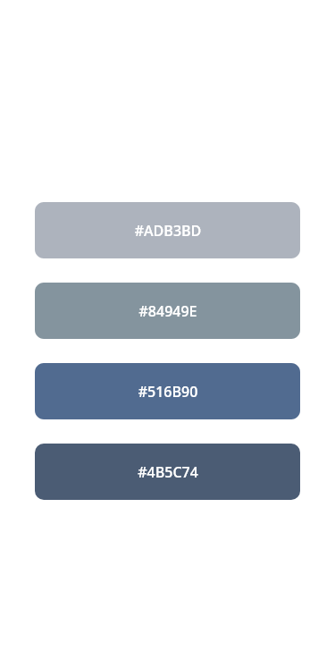

# Front-end Style Guide

## Layout

Design var gjord för dessa två mått i bredd

- Mobile: 375px
- Desktop: 1440px

## Färger

- Grå (`#ADB3BD`)
- Mörk grå (`#84949E`)
- Blå (`#516B90`)
- Mörk blå (`#4B5C74`)

## Typography

### Body Copy

- Font size (paragraph): 16px

### Font

- Family: [Open Sans](https://fonts.google.com/specimen/Open+Sans)
- Weights: 500, 700, 900

